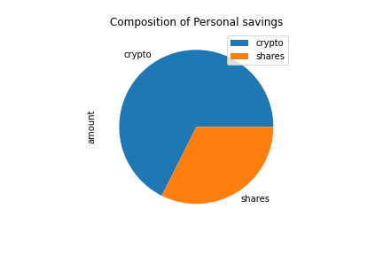

# APIs

## Background
You decided to start a FinTech consultancy firm, and you want to make a difference by working on projects with high social impact in local communities. You just won your first contract to help one of the biggest credit unions in your area. They want to create a tool that helps their members enhance their financial health. The Chief Technology Officer (CTO) of the credit union asked you to develop a prototype application to demo in the next credit union assembly.

The credit union board wants to allow the union's members to assess their monthly personal finances, and also be able to forecast a reasonably good retirement plan based on cryptocurrencies, stocks, and bonds.

In this homework activity, you will use all the skills you have learned until now - focusing on using APIs as part of the technical solution - to create two financial analysis tools.

1.  Will be a personal finance planner that will allow users to visualize their savings composed by investments in shares and cryptocurrencies to assess if they have enough money as an emergency fund.

2. Tool will be a retirement planning tool that will use the Alpaca API to fetch historical closing prices for a retirement portfolio composed of stocks and bonds, then run Monte Carlo simulations to project the portfolio performance at 30 years. You will then use the Monte Carlo data to calculate the expected portfolio returns given a specific initial investment amount.

### Part 1 - Personal Finance Planner

In this section of the challenge, you will create a personal finance planner application. To develop the personal finance planner prototype, you should take into account the following assumptions:

The average household income for each member of the credit union is $12,000.

Every union member has a savings portfolio composed of cryptocurrencies, stocks and bonds:

* Assume the following amount of crypto assets: 1.2 BTC and 5.3 ETH.

* Assume the following amount of shares in stocks and bonds: 50 SPY (stocks) and 200 AGG (bonds).

Use the starter Jupyter notebook to complete the following steps.

Collect Crypto Prices Using the requests Library

*Current AGG closing price: $117.88*

*Current SPY closing price: $347.25*

Create two variables called my_btc and my_eth. Set them equal to 1.2 and 5.3, respectively.

*The current value of your 50 SPY shares is $17362.50*

*The current value of your 200 AGG shares is $23576.00*

Use the requests library to fetch the current price in Canadian dollars of bitcoin (BTC) and ethereum (ETH) using the Alternative Free Crypto API endpoints provided in the starter notebook.

Compute the portfolio value of cryptocurrencies and print the results:

### Part 2 - Retirement Planning

In this section, you will use the Alpaca API to fetch historical closing prices for a retirement portfolio and then Use the MCForecastTools toolkit to create Monte Carlo simulations to project the portfolio performance at 30 years. You will then use the Monte Carlo data to answer questions about the portfolio.
Follow the steps outlined in the starter notebook to complete the following:

Monte Carlo Simulation

Use the Alpaca API to fetch five years historical closing prices for a traditional 40/60 portfolio using the SPY and AGG tickers to represent the 60% stocks (SPY) and 40% bonds (AGG) composition of the portfolio. Make sure to convert the API output to a DataFrame and preview the output.

Configure and execute a Monte Carlo Simulation of 500 runs and 30 years for the 40/60 portfolio.

Plot the simulation results and the probability distribution/confidence intervals.

## Challenge - Early Retirement

The CTO of the Credit Union was really impressed with your work on this planner, but commented that 30 years seems like such a long time to wait to retire! The CTO starts wondering if the retirement plan could be adjusted to account for an earlier than normal retirement.

Try adjusting the portfolio to either include more risk (a higher stock than bond ratio) or to have a larger initial investment and rerun the retirement analysis to see what it would take to retire in 5 or 10 years instead of 30!